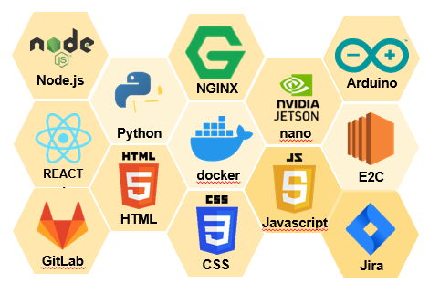
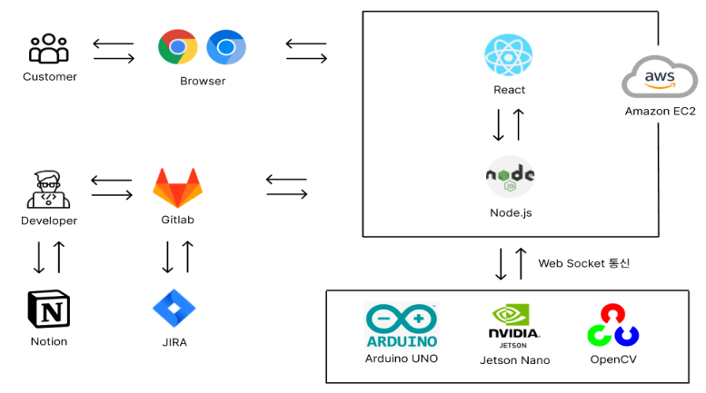
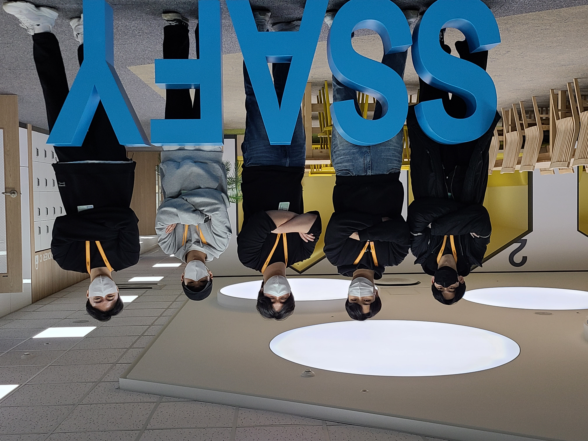

# 토렌즈(토일렛 프렌즈)
## 서비스 소개
> Toilet + Friend
- 유치원, 어린이집대상으로 양치, 세안, 손씻기를 교육 및 교정하는 서비스
- 스마트 미러로 만들어 아동들의 흥미를 유발하고 아동들이 좋아하는 캐릭터로 관심을 끌게하는 서비스
- [UCC 바로가기](추후 작성)

## 팀원 소개 및 담당 역할
- 김상래 (팀장) : 임베디드 개발, 프로젝트 관리
- 이영도 (팀원) : 임베디드 개발
- 이준호 (팀원) : 임베디드 개발
- 여도현 (팀원) : Front-End 개발
- 최선호 (팀원) : Back-End 개발

## 기술 스택
- IoT : OpenCV, Jetson nano, Arduino 
- Frontend : React 8.11.0
- Backend : Node.js, MySQL
- Infra : Amazon S3, Nginx

<br>

## 서비스

### 1. 대기화면에서 


### 2. 특정 시간에 얼굴 모션을 캡쳐해서 사람이 앞에 있으면 다음 화면으로 전환


### 3. 안내사항


### 4. 애니메이션 및 ar


### 5. 애니메이션 종료 후 도장화면


<br>

## DETAIL

### 0. Conventions

- **git commit message**

  > type: Subject 형태로 작성하기

  type

  - master : 제품으로 출시될 수 있는 브렌치. 최선의 상태 유지
  - Feat : 새로운 기능 추가
  - Fix : 버그 수정
  - Docs : 문서 수정
  - Refactor : 코드 리팩토링
  - Design : CSS 등 사용자 UI 디자인 변경
  - Comment : 필요한 주석 추가 및 변경
  - Rename : 파일 또는 폴더 명을 수정
  - Remove : 파일을 삭제하는 작업만 수행
  - HOTFIX : 급하게 치명적인 버그를 수정

  Subject

  - 50자를 넘기지 말 것
  - 대문자로 시작하며 마침표는 적지 않을 것
  - 명령조로 말할것. 예를들면 changed, changes 가 아닌 change

- **GitLab branch 전략**

  - master : 제품으로 출시될 수 있는 브렌치. 최선의 상태 유지
  - Feat : 새로운 기능 추가
  - Fix : 버그 수정
  - Docs : 문서 수정
  - Refactor : 코드 리팩토링
  - Design : CSS 등 사용자 UI 디자인 변경
  - Comment : 필요한 주석 추가 및 변경
  - Rename : 파일 또는 폴더 명을 수정
  - Remove : 파일을 삭제하는 작업만 수행
  - HOTFIX : 급하게 치명적인 버그를 수정

- **Jira**

  이슈생성

  - 월요일에 주 단위 스프린트 이슈들을 생성
  - 일주일에 40시간 이상 이슈 생성 및 처리

  이슈 완료

  - 하나의 티켓은 되도록 하나의 커밋으로 처리

- **Style Guide**

  FE

  - var대신 const, let 사용하기
  - 가능한 Arrow Function으로 함수식 작성

  BE

  - 변수명, 인스턴스명: camelCase
  - 상수 변수명(static final): 대문자, 띄어쓰기는 _ 사용
  - 클래스명, 생성자명: PascalCase
  - 함수명: camelCase(동사 + 명사로 구성)
  - Mysql table, column name: snake_case

<br>

### 1. Planning & Design

- 기술


- 아키텍처



<br>

### 2. Development & Test

```
├─public
│   │  favicon.ico
│   │  index.html
│   │  manifest.json
│   │  robots.txt
│   ├─img
│   ├─sounds
│   └─videos
│
└─src
    │  App.css
    │  App.js
    │  App.test.js
    │  index.css
    │  index.js
    │  reportWebVitals.js
    │  setupTests.js
    │
    ├─components
    │  ├─BridgeScreen
    │  │      audioAppears.js
    │  │      audioDisappear.js
    │  │      audioRun.js
    │  │      audioTts.js
    │  │      Hello.css
    │  │      Hello.js
    │  │      HelloGif.css
    │  │      HelloGif.js
    │  │      Main.css
    │  │      Main.js
    │  │      Next.css
    │  │      Next.js
    │  │      Run.css
    │  │      Run.js
    │  │
    │  ├─EduScreen
    │  │      EduScreen.js
    │  │      Notice.js
    │  │      Stamp.css
    │  │      VideoComponent.js
    │  │      WebSoket.css
    │  │      WebSoket.js
    │  │      WebSoket2.js
    │  │
    │  ├─WaitScreen
    │  │      CatchBf.css
    │  └─     EatLunch.js
    │  
    └─UseInterval.js
```

- Jira: 주단위로 월요일날 회의를 통해 이슈를 만들고 그 주 금요일 혹은 일요일까지 대부분 완료


<br>

### 3. PICTURE


<br>

### 4. ETC
캐릭터 출처 : <a href="https://kr.freepik.com/free-vector/happy-funny-cartoon-animals-set_8609221.htm#query=%EB%8F%99%EB%AC%BC%20%EC%BA%90%EB%A6%AD%ED%84%B0&position=0&from_view=keyword">작가 pch.vector</a> 출처 Freepik

음성 출처 : 인공지능 가상 연기자 서비스, 타입캐스트를 활용하여 제작되었습니다.
출연진: 채린, 호빈 <a href="https://app.typecast.ai/ko/dashboard">
